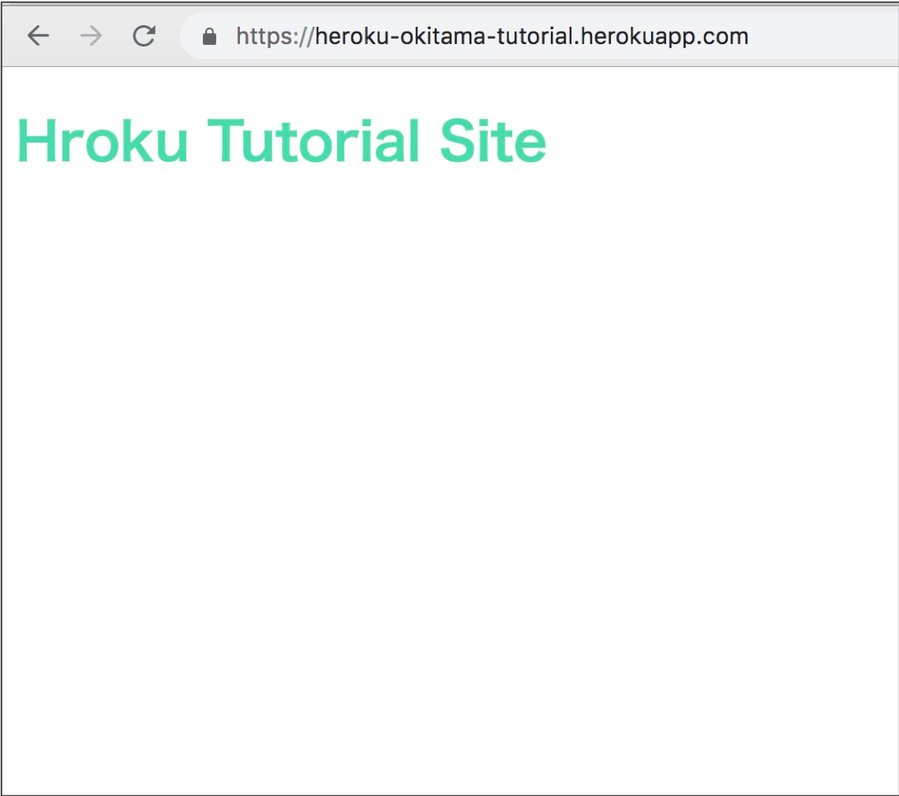
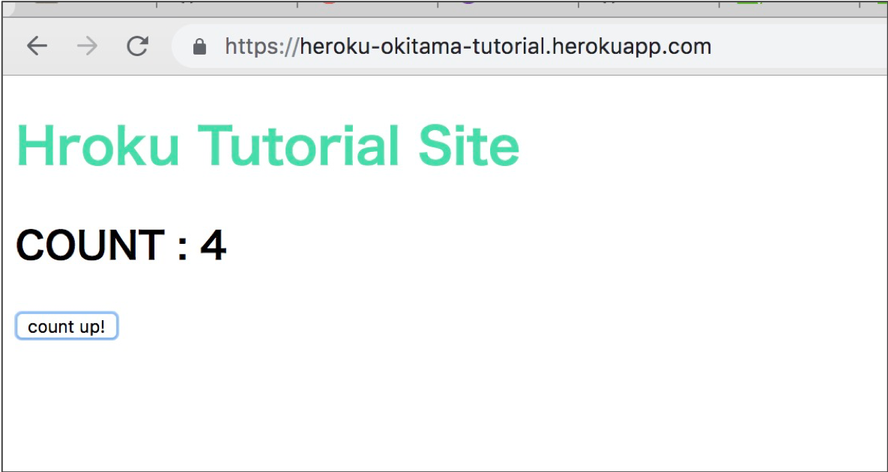
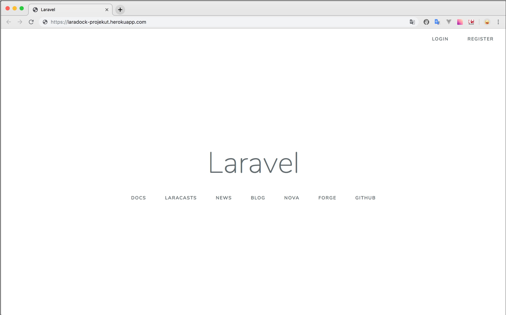

# laravel on dockerを実現する

dockerを使ってlaravelで開発し、Herokuへデプロイするまでの流れを備忘録的に記録します。

流れとしては以下のようにして進めていくつもりです。

1. プロジェクトの作成、Laravelの導入
2. Herokuの新規登録とCLIのダウンロードなど
3. LaravelプロジェクトをHerokuへデプロイ

こんな感じでかなりボリュームがあります。


## プロジェクトの作成、laravelの導入まで

dockerを操作するプロジェクトを作成してlaravelの導入までを説明します。

### プロジェクトフォルダの作成

任意のディレクトリを作成してgit管理をします。

私は`~/docker_project`以下でこのコマンドを実行しています。  
`~/`はルートディレクトリで、Macでは`/Users/ユーザー名`と同じ意味を持ちます。  

```bash
pwd
# /Users/ユーザー名/docker_project/

# プロジェクトディレクトリの作成
mkdir project_name && cd $_

# gitリポジトリの作成
git init
```

`project_name`は自分の好きな名前にしてください。作りたいサービス名やサイト名でいいでしょう。

### Laradockの用意

laravelをdockerで扱うために必要な物を一挙に提供してくれるプロジェクトです。  
これをGithubからダウンロードしてテンプレートとしてLaravelの環境をdocker上に作成します。  

```bash
# 念のため
pwd
# /Users/ユーザー名/docker_project/project_name

# Laradockのインストール
git submodule add https://github.com/Laradock/laradock.git

# Laravelの格納場所を用意
mkdir src
```

ディレクトリ構成の確認
念のため`tree`コマンドで確認しておきます。

> 
> Macではデフォルトで`tree`コマンドは使えないのでインストールする必要があります。
> `tree`コマンドはHomebrewを使って`brew install tree`でインストールできます。
> 

```bash
# /Users/ユーザー名/docker_project/project_name　のディレクトリで...
tree -L 1
# project_name
# ├── laradock
# └── src

```

### Laradockの設定ファイルを編集

サンプルファイルを複製して、`.env`を用意します。
今回はvimを使って`.env`を編集してみます。

```bash
cd laradock
cp env-example .env
vim .env
```

> vimでどこになんの記述があるか分からない場合は、コマンドモードにして`/検索ワード`とすると
> 検索することができます。

#### APP_CODE_PATH_HOST

Laravel自体のソースコードのパスを通します。
ここでは`src`以下に作成したので`project_name/src`となるようにします。

パスは`.env`ファイルからの相対パスで指定します。

```
APP_CODE_PATH_HOST=../src/
```

#### DATA_PATH_HOST

プロジェクトのデータの管理場所を指定
初期状態では`~/.laradock/data`だと、複数プロジェクトと同じデータを参照してしまうため変更します。

```
DATA_PATH_HOST=../.laradock/data
```

#### COMPOSE_PROJECT_NAME

dockerのコンテナ名を変更

```
COMPOSE_PROJECT_NAME=project_name
```

#### MYSQL_VERSION

MySQLのバージョンを指定

```
MYSQL_VERSION=5.7
```

### dockerの起動

`laradock`ディレクトリ内で`docker-compose up`する
`nginx`, `mysql`, `phpmyadmin`を指定して実行

```bash
docker-compose up -d nginx mysql phpmyadmin
```

### dockerコンテナの起動確認

以下の5つのコンテナが起動していることを確認

- phpmyadmin
- nginx
- php-fpm
- workspace
- docker-in-docker

```bash
docker ps --format "table {{.Names}}"

# NAMES
# project_name_nginx_1
# project_name_php-fpm_1
# project_name_phpmyadmin_1
# project_name_workspace_1
# project_name_docker-in-docker_1
# project_name_mysql_1
```

### laravelのインストール

laravelをインストールする。laravelのソースを`workspace`

```bash
docker-compose exec workspace bash

# php artisan --version
# Laravel Framework 5.8.29
```

ログインしたら以下を実行してlaravelをインストール

```bash
# omposer の高速化
# ミラーサーバをpackagist.jpに変更
composer config -g repos.packagist composer https://packagist.jp
# 高速化プラグイン
composer global require hirak/prestissimo

composer create-project --prefer-dist laravel/laravel ./
# 5.5.*のバージョン
composer create-project --prefer-dist laravel/laravel ./ 5.5.*

# インストールしたら
exit
```

#### laravelの設定

laravelのインストールが完了すると`src`ディレクトリに馴染みのlaravelのプロジェクトが作成される。

laravel自体の設定ファイルを変更する。

```bash
# srcディレクトリに移動
cd ../src/
vim .env
```

以下のSQL設定を変更。これは`laradock/.env`に設定されたものを使う。

```bash
DB_HOST=mysql
DB_DATABASE=default
DB_USERNAME=default
DB_PASSWORD=secret
```

### Laravelの開発画面

[localhost:80](http://localhost)

### phpMyAdminの使い方

`docker-compose up`でphpMyAdminを起動しているので
`localhost:8080`にアクセスするとphpMyAdminにログインできる。

```
サーバ: mysql
ユーザー名: default
パスワード: secret
```

### MySQLへの接続

設定を変えないと`php artisan migrate`などSQL操作ができないので設定を変更する。

一旦docker-compose stopする

```bash
docker-compose stop
```

- `.env`ファイルを変更する

`DB_HOST`が`127.0.0.1`とかになっていると思うが、`mysql`に変更する

```bash
 DB_CONNECTION=mysql
 DB_HOST=mysql
 DB_PORT=3306
 DB_DATABASE=default
 DB_USERNAME=default
 DB_PASSWORD=secret
```

- 変更が完了したら再起動

```bash
docker-compose up -d nginx mysql phpmyadmin
```
 
- 再起動できたらゲストにログインして、`migrate`してみる


```bash
docker-compose exec workspace bash

# ログインできたら
php artisan migrate

# Migration table created successfully.
# Migrating: 2014_10_12_000000_create_users_table
# Migrated:  2014_10_12_000000_create_users_table (0.08 seconds)
# Migrating: 2014_10_12_100000_create_password_resets_table
# Migrated:  2014_10_12_100000_create_password_resets_table (0.06 seconds)
```
これでOK


### MySQLの操作
MySQLの操作はMySQLコンテナへの接続をして行う

```bash
docker-compose exec mysql bash
mysql -u default -p
```

パスワードは`secret`

## Reference
> 
> [初心者がLaradockでLaravelを開発するための準備の仕方をまとめるよ \| 東京上野のWeb制作会社LIG](https://liginc.co.jp/465420)
> 

## Herokuの導入

ここではHerokuの導入とテストのために静的サイトの導入までを扱ってみたいと思います。


### 新規登録

以下のURLから新規登録を行います。  
特に問題なく登録はできるかと思います。

[クラウド・アプリケーション・プラットフォーム \| Heroku](https://jp.heroku.com/)

### Heroku CLIツールのダウンロード
ここでHerokuのドキュメントをみてみましょう。

[Documentation \| Heroku Dev Center](https://devcenter.heroku.com/categories/reference)

HerokuではCLIを用いてコマンドラインからデプロイなどの操作を行います。
Herokuの`Command Line Interface(CLI)`はHerokuアプリケーションをターミナルから直接`作成・管理`することを容易にします。

[The Heroku CLI \| Heroku Dev Center](https://devcenter.heroku.com/articles/heroku-cli)

ということでインストールしていきましょう

>
> ※ 注意
> HerokuのCLIではGitが必要になります。Gitがない場合はインストールしてください。
>

#### Homebrewでインストール

Homebrewでインストールします。

```bash
brew tap heroku/brew && brew install heroku
```

### Heroku CLIにログイン

Herokuへのログインは非常に簡単です。

```
heroku login
# 適用にキー入力が求められるので、エンターキーでも押す。
# ブラウザが開いてログイン画面が出てくるのでログインする
```

### 静的サイトの作成

Herokuにデプロイする静的サイトをphpで作成してみたいと思います。

任意のディレクトリを作成して`vim`で編集します。

```
mkdir HerokuSite && cd $_
vim index.php
```

vimで以下のコードを貼り付けてください。

```php
<?php
    $SiteName = "Hroku Tutorial Site";
?>

<!DOCTYPE html>
<html lang="ja">
<head>
    <meta charset="UTF-8">
    <title><?= $SiteName ?></title>
    <style>
        .title{
                color : #4da;
        }   
    </style>
</head>
    <body>
    <h1 class="title"><?= $SiteName ?></h1>
    </body>   
</html>

```

これで`HerokuSite`ディレクトリ以下に`index.php`が作成されたかと思います。

### リポジトリの作成とHerokuへの登録

ここで`git init`して`commit`しましょう

```bash
git init
git add .
git commit -m'🎉initial commit'
```

そしてHerokuへ登録するために`heroku apps:create`コマンドを実行します。
ターミナル上で`index.php`ディレクトリにいることを確認した上で
以下のコマンドを実行します。

```bash
heroku apps:create heroku-okitama-tutorial
# Creating ⬢ heroku-YourName-tutorial... done
# https://heroku-YourName-tutorial.herokuapp.com/ | https://git.heroku.com/heroku-okitama-tutorial.git
```

ここで`heroku-YourName-tutorial`は好きなサイト名にしてください。
<!-- 私は -> heroku-okitama-tutorial -->
既存のサイトと名前が被っていた場合はエラーが出ますので、違う名前に変更してください。

登録が完了したらHerokuへデプロイを行います。

```bash
git push heroku master

# remote: Verifying deploy... done.
# To https://git.heroku.com/heroku-YourName-tutorial.git
#  * [new branch]      master -> master
```

最後に上記のような表示が出たらデプロイ完了です。さて、表示されているサイトへアクセスして確認してみましょう。

※ サイトは現在停止させてます。
[Hroku Tutorial Site](https://heroku-okitama-tutorial.herokuapp.com/)



### Herokuサイトの更新

前節ではサイトの登録に成功したかと思います。　　
こんなにも簡単にデプロイできるなんて感激ですよね。Herokuヤバし。

さて、折角の作ったコンテンツ。アップデートしないとその魅力は引き出せません。
そこでサイト内で`javascript`を動作させてみましょう。

`app.js`

```javascript
(function() {
    $elem = elemID => document.querySelector(elemID);
    countInt = 0;
    $elem('#js-button').addEventListener('click', function() {
        countInt++;
        $elem('#js-counter').innerText = `COUNT : ${countInt}`;
    })
    console.log('Hello Heroku');
})();
```

また、`index.php`を以下のように書き換えます。

```php
<?php
$SiteName = "Hroku Tutorial Site";
?>

<!DOCTYPE html>
<html lang="ja">

<head>
    <meta charset="UTF-8">
    <title><?= $SiteName ?></title>
    <style>
        .title {
            color: #4da;
        }
    </style>
</head>

<body>
    <h1 class="title"><?= $SiteName ?></h1>
    <h2 class="counter" id="js-counter">COUNT : 0</h2>
    <input type="button" id="js-button" value="count up!">
    <script src="./app.js"></script>
</body>

</html>
```

そして変更が完了したらcommitして再デプロイします
ついでにに`.gitignore`を追加しても構いません。

```bash
git add .
git commit -m'add js file and update feature'
```
`commit`が完了したら`git push`をしてデプロイをします。


```
git push heroku master
```
これで再びサイトを見ればOKでしょう。




こんな感じで、Herokuを使えば非常に簡単にサイトをデプロイすることが可能になります。


## LaravelプロジェクトをHerokuへデプロイ

ここまでくるとLaravelのプロジェクトをHerokuへとデプロイできるような気がしてきます。　
ということでここからHerokuへのデプロイに向けて変更を加えていきます。

### MySQLからPostgreSQLへ乗り換え

HerokuではMySQLを使う場合、クレジットの登録が必要になります。  
そこで今回はPostgreSQLへ乗り換えてデプロイしたいと思います。

いったんdockerを閉じます

```bash
docker-compose stop
```

次に`laradock`ディレクトリの`.env`ファイルを編集します。

```
# WORKSPACE_INSTALL_PG_CLIENT=false
WORKSPACE_INSTALL_PG_CLIENT=true

# PHP_FPM_INSTALL_MYSQLI=true
PHP_FPM_INSTALL_MYSQLI=false

# PHP_FPM_INSTALL_PGSQL=false
PHP_FPM_INSTALL_PGSQL=true

# PHP_FPM_INSTALL_PG_CLIENT=false
PHP_FPM_INSTALL_PG_CLIENT=true

```

これができたら`laravel`プロジェクト自体の設定`.env`を変更します。
`src`ディレクトリ以下の`.env`ファイルを開いて

```
DB_CONNECTION=mysql
DB_HOST=mysql
DB_PORT=3306
DB_DATABASE=default
DB_USERNAME=default
DB_PASSWORD=secret
```

これを以下に置き換えます。

```
DB_CONNECTION=pgsql
DB_HOST=postgres
DB_PORT=5432
DB_DATABASE=default
DB_USERNAME=default
DB_PASSWORD=secret
```

そしたら再びDockerを立ち上げて使います。
先ほどは`docker-compose up -d nginx mysql phpmyadmin`としていましたが、
以下のように変更して実行して下さい。

```bash
docker-compose up -d nginx postgres pgadmin
```

`MySQL`を`PostgreSQL`、`phpMyAdmin`を`pgAdmin`に変更したことがわかるかと思います。

実行に成功するとログインできるようになるはずです。
以下のようにしてログインして`PostgreSQL`が動いているか確認します。

```
docker-compose exec workspace bash
```
ログインしたら次のコマンドで`postgresql`を使ってみます。

```bash
psql -h postgres -U default
Password for user default: secret # パスワードを入力する

default=# \d
                List of relations
 Schema |       Name        |   Type   |  Owner  
--------+-------------------+----------+---------
 public | migrations        | table    | default
 public | migrations_id_seq | sequence | default
 public | password_resets   | table    | default
 public | users             | table    | default
 public | users_id_seq      | sequence | default
 
 default=# select * from users;
  id | name | email | email_verified_at | password | remember_token | created_at | updated_at 
 ----+------+-------+-------------------+----------+----------------+------------+------------
(0 rows)

```
こんな感じで、テーブルを参照できたかと思います。

さらに`phpMyAdmin`のように ブラウザで`pgadmin`確認してみます。
[pgAdmin](http://localhost:5050)

ログインに関する情報は`### pgadmin ###########`のセクションに書いてあります。

```
### pgadmin ################################
# use this address http://ip6-localhost:5050
PGADMIN_PORT=5050
PGADMIN_DEFAULT_EMAIL=pgadmin4@pgadmin.org
PGADMIN_DEFAULT_PASSWORD=admin
```

### Herokuへのデプロイ

では`Herokuの導入`で行ったように、アプリケーションを作成して、Herokuへデプロイしていきましょう。

#### Herokuプロジェクトの作成

まずはターミナルで`laradock`, `src`直上の`project_name`に移ります。
そしてHerokuへのログインを行い、サービスの雛形を作成します。

```bash
cd project_name
heroku auth:login
# heroku: Press any key to open up the browser to login or q to exit: 
# キーを押してブラウザが立ち上がったらログインする
```

ログインが完了したらプロジェクトを作成します。

```
heroku create [アプリケーション名] --buildpack heroku/php
# Creating ⬢ laradock-projekut... done
# Setting buildpack to heroku/php... done
# https://laradock-projekut.herokuapp.com/ | https://git.heroku.com/laradock-projekut.git
```

今回は[アプリケーション名]を`laradock-projekut`にしてみました。
プロジェクトの作成に成功したら https://laradock-projekut.herokuapp.com/ にアクセスしてみて下さい。
サイトへのアクセスが可能になっているはずです。

#### Herokuアプリをリモートリポジトリとして登録する

`git`を使ってHerokuに`push`するために、リモートリポジトリに登録します。

```
git remote add heroku https://git.heroku.com/laradock-projekut.git
git remote -v
# heroku	https://git.heroku.com/laradock-projekut.git (fetch)
# heroku	https://git.heroku.com/laradock-projekut.git (push)
```

#### Herokuアプリの設定

デプロイするのに必要な設定について解説します。

##### APP_KEYの追加
 
Laravelでは`php artisan key:generate`とすることで、アプリケーションキーを発行することができます。
発行されたアプリケーションキーはLaravelの`.env`ファイル内に保管され、ユーザーセッションやデータの暗号化に役立ちます。
これは作成したLaravelプロジェクト固有の値を持ち、これらのアプリケーションキーをHerokuにも登録する必要があります。

ターミナル上で、アプリケーションキーを取得して、Herokuの設定に追加しましょう。

```bash
# laradockディレクトリに移動します。
cd project_name/laradock
docker-compose exec workspace php artisan --no-ansi key:generate --show
# base64:xxxxxxxxxx/xxxxx=
```
出力される`base64:xxx...`という文字列が`APP_KEY`です。
これをコピーしてHerokuへと登録します。

```bash
cd projectname
heroku config:set APP_KEY=base64:xxx...
Setting APP_KEY and restarting ⬢ laradock-projekut... done, v3
APP_KEY: base64:xxx....
```

##### PostgreSQLの登録

HerokuではDBにPostgreSQLを利用します。そのために前節ではMySQLからPostgreSQLに乗り換えました。
ここではHerokuでPostgreSQLを利用するために「Heroku Postgres」というアドオンを使います。

ということでインストールしましょう。

```bash 
cd laradock-projekut
heroku addons:add heroku-postgresql
# Creating heroku-postgresql on ⬢ laradock-projekut... free
# Database has been created and is available
#  ! This database is empty. If upgrading, you can transfer
#  ! data from another database with pg:copy
# Created postgresql-lively-65690 as DATABASE_URL
# Use heroku addons:docs heroku-postgresql to view documentation
```
これで`PostgreSQL`が利用可能になります。
次に、Laravelのプロジェクトと`PostgreSQL`の紐付けを行います。

##### PostgreSQLとLaravelプロジェクトの紐付け

`PostgreSQL`とLaravelプロジェクトの紐付けも`heroku config:set`コマンドを用いて行います。
紐付けするパラメータは`src`ディレクトリの`.env`ファイル内のDB設定になります。
`MySQL`から`PostgreSQL`へ乗り換えをする際に編集したところですね。

```swift
DB_CONNECTION=pgsql
DB_HOST=postgres
DB_PORT=5432
DB_DATABASE=default
DB_USERNAME=default
DB_PASSWORD=secret
```
これを`heroku config:set`で一つ一つ登録していきます。

```bash
heroku config:set DB_CONNECTION=pgsql
heroku config:set DB_HOST=postgres
heroku config:set DB_PORT=5432
heroku config:set DB_DATABASE=default
heroku config:set DB_USERNAME=default
heroku config:set DB_PASSWORD=secret
```

こんな感じでHerokuに登録したデータベースの情報は`heroku config`で参照することが可能です。

```bash
heroku config

# === laradock-projekut Config Vars
# APP_KEY:       base64:xxxx....
# DATABASE_URL:  postgres://sfryucabwesf...
# DB_CONNECTION: pgsql
# DB_DATABASE:   default
# DB_HOST:       postgres
# DB_PASSWORD:   secret
# DB_PORT:       5432
# DB_USERNAME:   default
```

##### Herokuアプリの画面パス設定ファイルを作成する

今回、Laradockでは`nginx`を使って開発を行いました
ここでは以下のサイトを参考にして`Apache`でHTTPサーバーを動かしてみたいと思います。
[Laravelアプリをherokuで動かすチュートリアル | Qiita](https://qiita.com/kamukiriri/items/73ff35fc7f9083ca68c1)
[Herokuで公開してみよう | チームラボオンラインスキルアップ課題](https://team-lab.github.io/skillup/step2/10-heroku.html)

まず、`src`ディレクトリに移動して`Procfile`に設定を書き込みます。

```bash
cd projectname/src
echo web: vendor/bin/heroku-php-apache2 public/ > Procfile
```

ちなみに`nginx`でHTTPサーバーを動かす場合は`src`ディレクトリで以下のようにします。

```bash
cd projectname/src
echo web: vendor/bin/heroku-php-nginx -C nginx_app.conf public/ > Procfile
echo 'location / { index index.html index.php; try_files $uri $uri/ /index.php?$query_string; }' > nginx_app.conf
```


#### Herokuにデプロイする

さてここまできたらデプロイの準備は完了です。
`git`でコミットして実際にデプロイしてみます。
git操作しているディレクトリ(`src`, `laradock`直上)に移ってまずはコミットします。

```bash 
cd project_name
git add .
git commit -m'deploy to Heroku'
```
次にデプロイのために`src`のみをpushします。


```bash
git subtree push --prefix src/ heroku master

# ....
# remote: Verifying deploy... done.
# To https://git.heroku.com/laradock-projekut.git
#  * [new branch]      fjejawifjea20200 -> master

```
こんな感じでエラーなく`daploy.... done`となればデプロイに成功しているはずです。

`heroku open`とコマンドを入力をして実際にデプロイしたページをみてみましょう。



これで終了ではありません。`php artisan migrate`を忘れています。
試しに、ログインページや登録ページを操作してみるとエラーが生じるはずです。

#### Heroku上のDBでマイグレーションを実行する

Hrokuでマイグレーションが実行できるように、`migrate`をHerokuアプロケーションにインストールします。

```bash
cd project_name
heroku run "php artisan migrate:install"
heroku run "php artisan migrate:status"
heroku run "php artisan migrate"
Running php artisan migrate on ⬢ laradock-projekut... up, run.3621 (Free)
**************************************
*     Application In Production!     *
**************************************

 Do you really wish to run this command? (yes/no) [no]:
 > yes

Migrating: 2014_10_12_000000_create_users_table
Migrated:  2014_10_12_000000_create_users_table (0.04 seconds)
Migrating: 2014_10_12_100000_create_password_resets_table
Migrated:  2014_10_12_100000_create_password_resets_table (0.02 seconds)
```

これでマイグレーションが完了しました。
再び`heroku open`で作成したアプリケーションが動作しているか確認します。


ユーザー登録やログインなどが上手くいけばOKです。めでたしめでたし。


## REFERRENCE 
>
> 
>
>