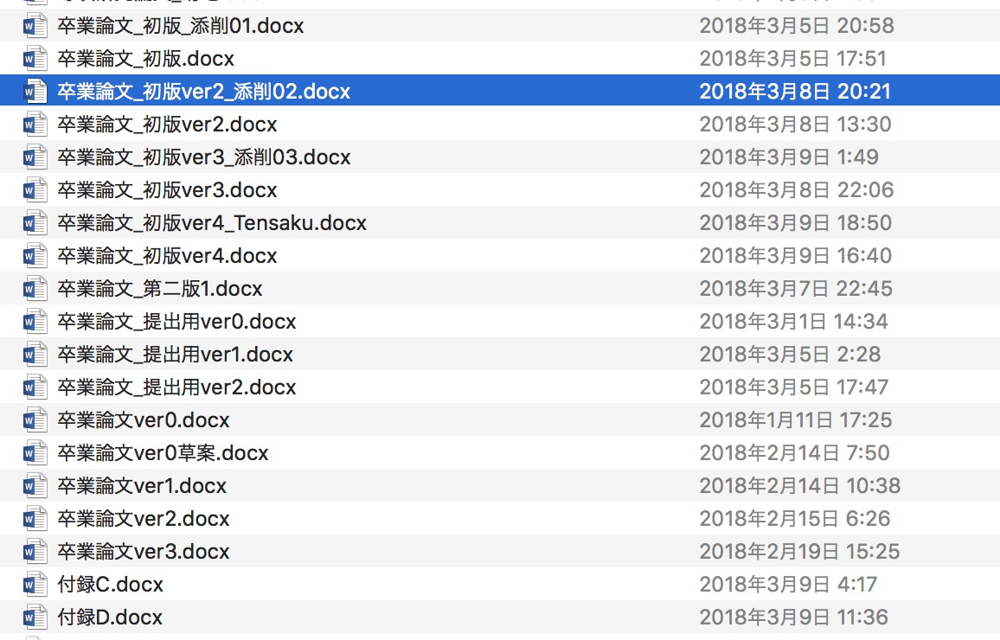
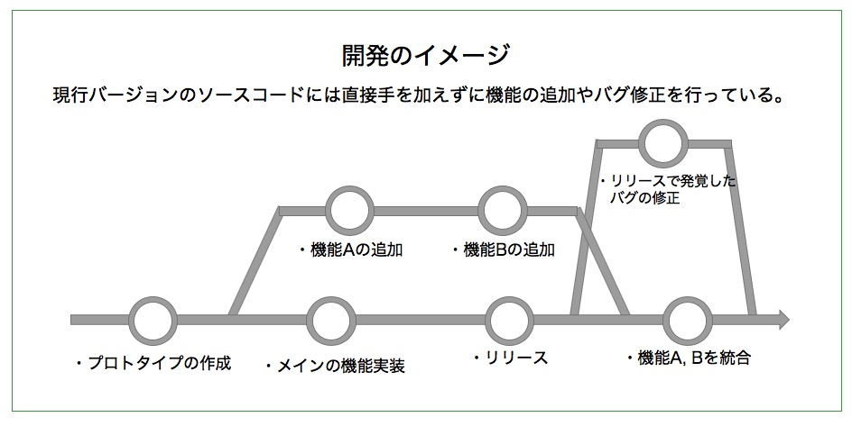
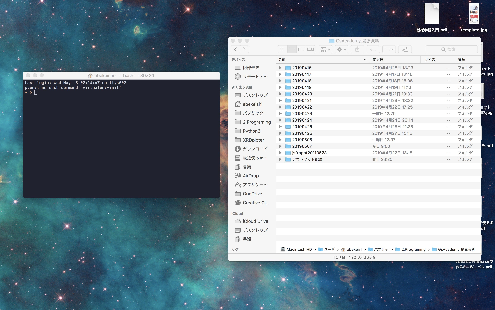
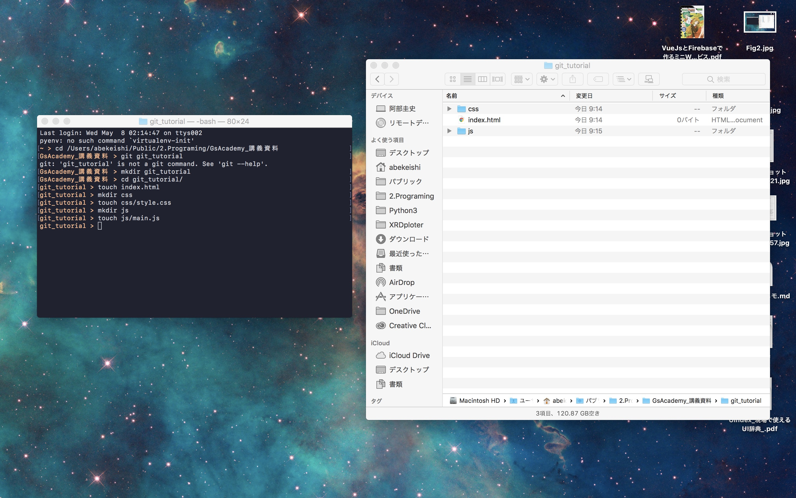
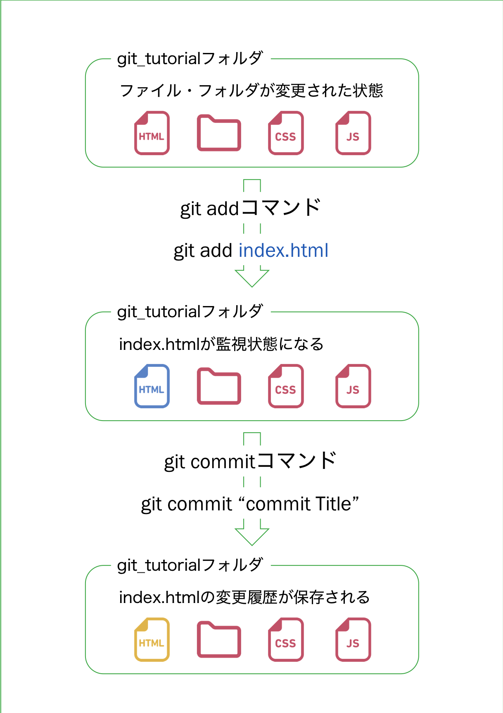
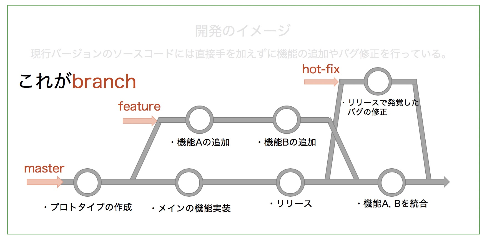
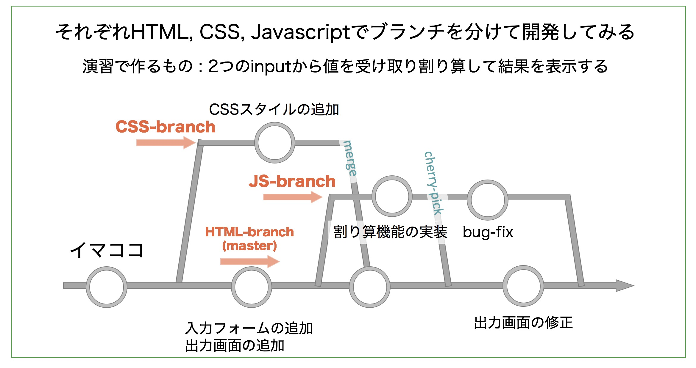

# 実際に使って苦しんで覚えるGit・Github入門
[目次]
- はじめに
- そもそもGitとは何か
- まとめ
- Gitのインストールと実行
- Gitを操作しよう
  - プロジェクトの作成
  - 初期化
  - Gitで変更履歴を保存する
    - `git status`でファイルの変更履歴を確認
    - `git add`でステージングを行う
    - `.gitignore`の書き方
    - `git commit`で変更履歴を保存
    - `git log`で変更履歴を参照
    - `git branch`でブランチをきる
      - ブランチの作成とチェックアウト
      - `master`ブランチへ戻る
      - `CSS-branch`と`master`の統合(merge)
      - `JS-branch`を`master`に抜き取る(cherry-pick)
      - `JS-branch`を`master`へ統合・コンフリクトの解消
- おまけ・ブランチを管理する考え方
- その他参考になるチートシート

## はじめに
GitやGithubという名前を聞いたことはあるかもしれません。しかし正直なんなのか、なんで利用されているのかについてはよく分からないのが現状かと思います。  
また、知っていて利用していても`branch`がよく分からず、`master`1本で漢気溢れる開発を行ってしまいがちです。  

幸いにもIDEなどが発達し、GitをGUIで手軽に管理しGithubへボタン一つで`push`できるようになりました。  
しかし、どうせ使うなら仕組みをある程度理解し、`terminal`から実行できるようになりたいものです。  
今回はそんな人のためにGitを最低限使えるように。そしてGithubを使って作成したコードを公開する手順について、これらの有用性について触れながら概観して行こうと思います。  
というか私がよく分かっていないので理解するついでにテキストに起こしています。  
あくまでハンズオンとして書いているので、少し内容が分かりにくいかもしれません。  
そんな時は手を動かして理解しましょう。。。。

もともと共同開発してくれるメンバー向けに作成したのですが、どうせなら公開してしまおうと思います。  
誤りや理解できない点があれば気軽に言ってください。  
また、私自身の理解が拙いほか、分かりやすさを優先するため厳密性は犠牲にします。

### 本書の対象者
このハンズオンでは以下の人を対象にしています。
- GitやGithubが分からない。
- 知ってはいるけど使い方、使う状況が分からない。
- 使い方を忘れてしまう。(最後にGit頻出チートシートを書いておきます)

### 本書の対象者ではない人
- 普段からGitやGithubを使ってbranchやmerge, コンフリクトの解消などもお手の物の人

### 基本用語の定義と注意点
#### 基本用語の定義
解説する上で用いる基本的な用語について簡単に説明します。  
Git固有の名前についてはここでは説明しませんが、出てくるときに適宜説明していくので大丈夫です。

- `ターミナル` : コマンドでMacに操作を伝えるための画面です。(FinderやSpotlightでターミナルと検索して開いてみましょう)
- `ディレクトリ` : 一般にフォルダのことを指します。記録メディア上のファイルの保存場所です。
- `カレントディレクトリ` : 今自分がいるディレクトリです。ターミナルでファイル操作を行う場合は、対象のディレクトリをカレントディレクトリとして操作を行います。
- 


#### *※ 注意*
ターミナルでの操作は以下の内容にしたがっています。
- `$`は入力する必要はありません。ターミナルを開くと先頭に表示されるPC名やディレクトリ名を短縮したものです。  
- `$`が書かれていない部分はターミナルの出力になります。
例 ) 
```
$ git --version
git version 2.17.2 (Apple Git-113)
```


## そもそもGitとは何か
これから私たちが使おうとしているGitとはそもそも何者なのでしょうか。  
> `Git`は、プログラムのソースコードなどの変更履歴を記録・追跡するための分散型バージョン管理システムである。  
> Linuxカーネルのソースコード管理に用いるためにリーナス・トーバルズによって開発され、それ以降ほかの多くのプロジェクトで採用されている  
> <a href="https://ja.wikipedia.org/wiki/Git">Git | Wikipedia</a>

なるほど。何と無く分かりましたよね。  
ここで例を挙げて考えて見ます。
<figure id="Fig1-1">

<figcaption><p style="text-align:center">Fig1-1. やばいバージョン管理のやり方</p></figcaption>
</figure>

この`Fig.1-1`は私が卒論を書いていた時のフォルダの中です。  
これは極端な例なのですが、フォルダやファイルをパックアップとしてコピーすることは1度はしたことがあると思います。  
しかし、これでは管理が大変です。ましてやプログラミングのように様々なファイルを管理するとなるとこのやり方では限度があります。  
そこで生まれのがバージョン管理システムで、Gitはその中の1つです。  

`Git`では過去の変更履歴を保存しておき、いつでもそのバージョンに戻すことが可能です。  
そして`ブランチ(以下 branch)`という影響を与えない環境を作り、変更を行います。  
変更がうまくいったら`マスター(以下 master)`という現行バージョンの本番環境に統合してデプロイします。

実際の開発現場でも`branch`を利用してプロジェクトを管理しているようです。  
以下に模式的な例を示します。  
<figure id="Fig1">

<figcaption><p style="text-align:center">Fig1. 開発時のファイル更新のイメージ</p></figcaption>
</figure>

`Fig.1-2`のように開発現場でプロトタイプを作成し、機能を実装、リリースしたとします。    
リリースしたのちにサービスを動かしているソースコードに直接変更を加えるのは賢明ではないようです。  
なぜなら間違って必要なものを消してしまったり、重大なバグを引き起こす可能性があるためです。  
そのため、機能の追加やバグの修正を行う際は`Fig.1-2`のように変更履歴を枝分かれさせて開発を行うようです。  
このように履歴を枝分かれさせることを`ブランチをきる`といい、変更がうまく行きそうなら本番環境に統合してデプロイします。  
Gitはこのようにしてプロジェクトの管理に利用されているようです。  


### Gitでは何ができるの？
Gitの概要を簡単に説明しましたが、ここでGitでできる事を列挙していきます。

- 変更履歴を管理できる。(いつ、どのように、どんな変更をしたかをフォルダごと保存できます。)
- 変更履歴を元に、差分を表示してくれる。(どこに変更が加わっているか一発で比較できます。)
- 変更履歴を一覧表示できます。(いつ、どのような変更を行ったか一目で確認できます。)
- 仲間と共有できる。(リモートで管理することで、チームで利用することができます)
  
### Gitで出来ないこと
逆にできないこととは何でしょうか。列挙してみます。
- 未来のソースコードを参照する。(自分で作るしかありません。)
- ファイル単位で履歴を保持しない(少し誤解をうみそうですが、ファイルを変更して保存(commit)する際は`環境全体`を保存するため、ファイルごとに独立したバージョン管理はできません。どうしても分けたい場合は`環境`を変えるしかありません)

## まとめ
Gitはバージョンを管理するためのシステムです。これまでバックアップとしてファイルをコピーしていたものを一元管理できるようにします。  
そして変更履歴の参照や、過去に戻ること、変更箇所の差分表示など開発を行う上で便利な機能が豊富に揃っています。  
ここからは実際にGitをインストールして実行していきたいと思います。

# Gitのインストールと実行
早速、Gitをインストールし使っていきましょう。  
まずはじめに、GitがあなたのMacにインストールされているか確認しましょう。  
ターミナルを立ち上げて以下のコマンドを実行します。

```
$ git --version
git version 2.17.2 (Apple Git-113)
```
上のようにGitのバージョン情報が出なかった場合はGitをインストールする必要があります。  
私の場合は`version 2.17.2`と表示されましたが、インストールされていれば基本どのバージョンでも大丈夫です。


インストールは以下のサイトを読めば大丈夫です。  

<a href="https://tracpath.com/bootcamp/git-install-to-mac.html#">Git のインストール 〜Git をMacにインストールしよう〜</a>

いくつかインストール方法が提示されていますが、個人的には`Homebrew`を使った方が楽なんじゃないかと思っています。


## Gitの設定
私たちがGitを使う上でやっておいたほうがいい設定がいくつかあります。  
ここではその設定について説明していきます。

### Gitの出力をカラフルにして見やすくする

```
$ git config --global color.ui auto
```

### 日本語ファイルの文字化けを防ぐ
Gitはデフォルトでは日本語ファイルを読み込んだ時に文字化けすることがあります。  
```
$ git config --local core.quotepath false
```

### Githubのメールアドレスとアカウント名を登録
これは後ほどGithubとの連携で再度説明しますが、以下のように設定します。  
入力するユーザー名とメールアドレスはGithubで登録したものにします。

```
$ git config --global user.name "USERNEMA"
$ git config --global user.email "USER-MAIL@example.com"
```

# Gitを操作しよう
## プロジェクトの作成
まずはGit管理するためのプロジェクトを作成しましょう。  
Finderでお好きなフォルダに移ってください。そしてターミナルを立ち上げましょう。  
この二つが画面上で並べておいたほうがいいかも知れません。  

<figure id="Fig2">

<figcaption><p style="text-align:center">Fig2. ターミナルとフォルダを並べて表示</p></figcaption>
</figure>

`Fig2`のように用意が出来たらFinderをクリックして`command + option + C`を押します。  

これはカレントディレクトリの`絶対パス`をコピーしています。そしてターミナル操作に移ります。

```bash
# cdと入力して、コピーした絶対パズをペーストします。
# cdはカレントディレクトリの略で、これから操作するディレクトリを指定します。
$ cd /Users/Public/2.Programing/GsAcademy_講義資料

# カレントディレクトリにフォルダを作成します。
$ mkdir git_tutorial
# 作成したフォルダに移ります。
$ cd git_tutorial/
```

終わったらFinderをみてみて下さい。開いていたフォルダの中に`git_tutorialフォルダ`が作られているはずです。  
では`git_tutorialフォルダ`を開き、再びターミナル操作を行います。

```bash
#ファイルやフォルダを作成します。
$ mkdir css js | touch index.html css/style.css js/main.js
```
これらのコマンドを実行したらあなたの画面はこのようになっているはずです(Fig3)。  

<figure id="Fig3">

<figcaption><p style="text-align:center">Fig3. プロジェクト作成後のFinder</p></figcaption>
</figure>


さて`index.html`を開いて少し編集してみましょう。`index.html`が開けたら以下の内容をコピペして保存します。
```html
<!DOCTYPE html>
<html lang="en">
<head>
    <meta charset="UTF-8">
    <meta name="viewport" content="width=device-width, initial-scale=1.0">
    <meta http-equiv="X-UA-Compatible" content="ie=edge">
    <title>Gitの練習つらい</title>
</head>
<body>
    <h1>Hello Git, Github!!</h1>
</body>
</html>
```
これでプロジェクト作成が完了しました。
ここで次にGitを初期化してGitを使っていきます。

## 初期化 (git init)
Gitを用いてソースコードのバージョン管理を行う際は、はじめにそのディレクトリでGitを`初期化`します。  
要は「今からこのディレクトリをGit管理するよ」と宣言するようなものです。  
`初期化`してGit管理を行う環境を`リポジトリ`と呼びます。


先ほどプロジェクトを作成したので、引き続きターミナルで以下のコマンドを実行します。
```bash
$ git init
Initialized empty Git repository in /Users/Public/2.Programing/GsAcademy_講義資料/git_tutorial/.git/
```
`Initalized....,`とメッセージが表示され`git_tutorial`フォルダの中に`.git`という隠しフォルダが生成されたかと思います。  
これで`git`によるバージョン管理の環境が用意されたことになります。  
見つからない人は、隠しフォルダを表示させるために`command + shift + .(ピリオド)`を入力して下さい。するとFinderが一旦閉じますが、再び開くことで隠しフォルダを見ることができるようになります。

なお、`git init`コマンドの構文は以下の通りです。
```bash
$ git init [ディレクトリ] [オプション]
# [ディレクトリ  : ここで指定したディレクトリをgit init します。指定しなければカレントディレクトリです。
# [オプション]   : 初期化する際のオプションを記述します。
#     --bare    : 最小限のリポジトリを作成する。
#     --shared  : 作成するリポジトリが複数のユーザーで共有されることを指定します。
#                 これにより共同管理が可能になります。

```


## Gitで変更履歴を保存する
`git init`で初期化したので実際に変更履歴を保存していきます。  
流れとしては
1. `git status`でファイルの変更を確認する.
2. `git add .` でステージングする.  
   `ステージング`ではこれから変更履歴を保存するファイルやフォルダを指定します。
3. `git commit` で変更履歴を保存する
4. `git log` で変更履歴を参照する。

といった感じです。この辺の表現が難しいですね。
<figure id="Fig">

<figcaption><p style="text-align:center">Fig4. git管理の流れ</p></figcaption>
</figure>


 
また、gitで管理したくないファイルを`.gitignore`で指定して変更を監視しないようにします。


### `git status`でファイルの変更を確認するう
gitで管理しているプロジェクト内でファイルの変更があったかどうかを、`git status`で状態を確認することができます。  
```bash
$ git status
# On branch master
# 
# No commits yet
# 
# Untracked files:
#   (use "git add <file>..." to include in what will be committed)
# 
# 	.DS_Store
# 	css/
# 	index.html
# 	js/
# 
# nothing added to commit but untracked files present (use "git add" to track)
```
このように、プロジェクトを作成した際に用意したファイルやフォルダが出力されました。  
これらはまだステージングを行なっていないため、 変更履歴を適用する  
また、「まだファイルの変更履歴を保存していませんよ。」といったメッセージが表示されているのがわかります。

次にこれをステージングします。
### `git add`でステージング
さて、変更履歴を保存するために`git add`コマンドをもといて`ステージング`します。  
試しに`index.html`のみをステージングしてみます。  
`ステージング`したら`git status`を用いて`ステージング`が適用されているか確認します。
```bash
$ git add index.html
$ git status
# On branch master
# 
# No commits yet
# 
# Changes to be committed:
#   (use "git rm --cached <file>..." to unstage)
# 
# 	new file:   index.html
# 
# Untracked files:
#   (use "git add <file>..." to include in what will be committed)
# 
# 	.DS_Store
# 	css/
# 	js/
#
```
`index.html`がなくなっているのでおっけいですね。

#### `git add`コマンドの応用
`git add`では`git add inded.html`とファイルを指定していました。  
`git add`では全てのファイルやフォルダを一括でステージングしたり、特定の拡張子のみをステージングしたりできます。  
ここでは応用としてこれらを説明します。

##### 全てのファイル、フォルダをステージングする
```bash
$ git add .
```

##### 特定の拡張子のみをステージングする
```bash
$ git add *.html  # HTMLファイルのみ
$ git add *.css   # CSSファイルのみ
```

##### ステージングされるファイルのチェック
実際にステージングされずにどのファイルがステージングされるか出力することができます。  
要はステージングするファイルの確認用ですね。慣れないうちはこちらで一度確認してからやったほうがいいかもです。
```bash
$ git add -n *.html
```

##### 複数ファイルを指定してステージング
2, 3のみのファイルであればファイル名を指定してステージングするのもありです。
```
$ git add index.html css/style.css js/main.js
```

こんな感じで時と場合で使い分けます。また`git add`のオプションは色々あるので調べてみると発見があるかもしれません。


##### `.gitignore`ファイルで監視対象外のフォルダやファイルを指定
ところで、`git status`をした時に`.DS_Store`という作った覚えのないファイルが表示されていましたね。  
これはMacでファイル操作を行なった時に自動生成されるファイルだそうです。  
実際のソースコードとは関係がないので変更の監視対象から外してしまいましょう。  

```bash
# .gitignoreファイルを作成する
$ touch .gitignore
# .gitignoreファイルを開く
$ open .gitignore
```

開いた`.gitignore`ファイルに以下の内容を入力して保存します。

```
.DS_Store
.gitignore
```
ここでは`.DS_Store`を監視対象から外して、ついでに作成した`.gitignore`も監視対象外にしました。
そして再び`git status`で状態を確認しましょう。

```bash
$ git status
# On branch master
# 
# No commits yet
# 
# Changes to be committed:
#   (use "git rm --cached <file>..." to unstage)
# 
# 	new file:   index.html
# 
# Untracked files:
#   (use "git add <file>..." to include in what will be committed)
# 
# 	css/
# 	js/
```

これで監視対象外にできましたね。
このように`.gitignore`では監視対象外のファイルやフォルダを指定することで変更履歴を追わないようにすることができます。  
`.gitignore`で指定したファイルやフォルダは監視対象外になるので、Githubにアップロードする際に除外されます。  
また、容量の大きいフォルダを監視対象外にすることでアップロード時間を短縮するような使い方もできます。


### `.gitignore`の書き方
`.gitignore`では以下のように監視対象外にするファイルやフォルダを指定します。

- ファイルの場合  
  - [単純なファイル名]
  - [*.js] : 特定の拡張子のみ除外
  
- フォルダの場合
  - [単純なフォルダ名] 直下のフォルダないのファイルやフォルダを全て除外
  - [フォルダ名/フォルダ名] : ディレクトリの直下にある特定のフォルダを除外


### `git commit`で変更履歴を保存する
さてステージングや不要なファイルの除外ができたので実際に`commit`して変更履歴を保存してみましょう。
ここで前節でステージングしなかったフォルダをステージングしてしまいましょう。
```bash
$ git add .
$ git status
# On branch master
# 
# No commits yet
#
# Changes to be committed:
#   (use "git rm --cached <file>..." to unstage)
# 
# 	new file:   css/style.css
# 	new file:   index.html
# 	new file:   js/main.js
#
#

```
さて初めての`commit`をしましょう！

```bash
$ git commit -m "初めてのGit!!"
# [master (root-commit) ab24e84] 初めてのGit！！
#  3 files changed, 0 insertions(+), 0 deletions(-)
#  create mode 100644 css/style.css
#  create mode 100644 index.html
#  create mode 100644 js/main.js
```
これでコミットが完了しました。  
`git commit -m"テキストを入力"`の`-m`は変更履歴に関するメモを残すためのオプションです。これは`コミットメッセージ`と呼ばれ、1行だけではなく普通の文書として保存することが可能です。

#### `git commit`コマンドの応用
##### コミットメッセージを複数行書く
コミットメッセージを複数業書く場合は、`-m`の後に`"テキスト"`という様に入力すれば大丈夫です。
```
$ git commit -m"version 0.3.5" -m"イベントリスナーのバグを修正"
```
他にもコミットメッセージを保存するためのエディタを起動することもできます。
これはコミットメッセージを入力せずにそのまま`git commit`とします。
```
$ git commit
```


### `git log` で変更履歴の参照
ようやく変更履歴を保存できました。ここで、変更履歴が本当に保存されているか確認してみます。
```bash
$ git log
# commit ab24e84c9e0bda0510f47ddfd9540cd558ba5b3e (HEAD -> master)
# Author: Tanisuke Goro <keisi1100525@outlook.jp>
# Date:   Wed May 8 18:17:24 2019 +0900
#
#    初めてのGit！！
```
1行目に`commit id`と呼ばれる変更履歴と紐付けるIDが出力されています。また、コミットした際の日時やコミットした人の情報も載ってますね。

#### `git log`の応用

##### `git log --oneline`
変更履歴をシンプルに1行で表示します。  
これにより変更の流れを俯瞰してみることができます。
ここでは1行目のコミットメッセージが表示されるため、自分で`git commit`する際の最初の1行は極めて重要になります。  
後から見返して最初の1行を見ただけで変更を思い出せる様に意識して書くといいと思います。
```
$ git log --oneline
```

##### `git log --graph`

git log の出力に commit の軌跡を見せてくれるオプション
普通に見ると commit comment とかでやたらと長ったらしくなるので --oneline option と組合せる事が多い。
以下の様にブランチを切った時のコミットやそれが統合されていることがよくわかる。
```
$ git log --graph --oneline
* 9b6d743 commit comment
* 9b56b4e comment
*   a49b6aa Merge branch 'master' of /path/to/repo
|\  
| * f123447 remove old file
| * 3fa194a add new file
| * 7b3eb4f remove backups
* | 3309805 I think I did something
|/  
* ddfa3b5 do comment
* fc499de we are comment
```


### `git branch`でブランチをきる
ここまでに`git status`, `git add`, `git commit`が使える様になりました。  
ここまでくれば`master`一本で漢気溢れる開発が可能になったわけです。  
ここで`master`ってなんだよ。となるわけです。
ここで以下のコマンドを実行して見ます。
```bash
$ git branch
# * master
```
これが`branch`で現在の`branch`が`master`であることがわかると思います。  
ではブランチとはなんでしょうか？

- branchとは  
  > ブランチとは、履歴の流れを分岐して記録していくためのものです。  
  > 分岐したブランチは他のブランチの影響を受けないため、同じリポジトリ中で複数の変更を同時に進めていくことができます。

まさにこれです。
<figure id="Fig5">

<figcaption><p style="text-align:center">Fig5. ブランチの正体</p></figcaption>
</figure>


この様に、`git`ではいくつかの環境に枝分かれさせながら開発を進めることができます。`枝 = branch`ですね。  
そしていくつかのブランチを作成して他のバージョンに影響が出ない様に開発を進めることができます。  


プロジェクトを立ち上げたときは`master`で開発を進めます。そして必要に応じて`branch`を作成して他の`branch`で開発を進めます。
枝分かれした`branch`を`master`に統合し、変更を適用することを`merge`と言います。  

それでは実際に`branch`を切って開発を進めてみましょう。
今回は以下の図のようなフローで割り算してくれるアプリを作成します。
<figure id="Fig6">

<figcaption><p style="text-align:center">Fig6. 演習の開発フロー</p></figcaption>
</figure>


#### CSSブランチの作成とチェックアウト
まずはじめに、`CSS-branch`を作成してCSSスタイルを追加したいと思います。  
gitではブランチを作成して移動するのに`git branch 作成するブランチ名`と`git checkout 移動するブランチ名`を使います。

```bash
$ git branch CSS-branch
$ git checkout CSS-branch
# Switched to branch 'CSS-branch'
```

そして`css/style.css`を開いて以下のコードをペースとします。

```css
.contents {
    width: 400px;
    margin: auto;
    margin-top: 50px;
}

#output-area {
    width: 300px;
    height: 100px;
    background-color: #fbcfcf;
}
```
そして`commit`しましょう。

```bash
$ git status
# On branch CSS-branch
# Changes not staged for commit:
#   (use "git add <file>..." to update what will be committed)
#   (use "git checkout -- <file>..." to discard changes in working directory)
# 
#         modified:   css/style.css
# 
# no changes added to commit (use "git add" and/or "git commit -a")
$ git add .
$ git commit -m"CSSスタイルの作成"
# [CSS-branch 3916bbb] CSSスタイ
#  1 file changed, 11 insertions(+)
#
```
`CSS-branch`のコミットが完了しました。  
これ以上`CSS-branch`で変更を行うことはないので、`master`に戻ってHTMLの編集を行います。


#### CSS-branchからmasterブランチへ戻る
以下のコマンドでmasterに移ります。移動できているか確認したいなら`git branch`を入力してください。
```
$ git checkout master
```
そして`index.html`に以下をコピペします。

```HTML
<!DOCTYPE html>
<html lang="en">

<head>
    <meta charset="UTF-8">
    <meta name="viewport" content="width=device-width, initial-scale=1.0">
    <meta http-equiv="X-UA-Compatible" content="ie=edge">
    <title>Gitの練習つらい</title>
</head>

<body>
    <div class="contents">
        <h1>Hello Git, Github!!</h1>
            <input type="text" id="arg1" class="input-area">
            <input type="text" id="arg2" class="input-area">
            <button id="sum_btn">割り算</button>
        <p id="output-area">
        </p>
    </div>
    <link rel="stylesheet" href="css/style.css">
    <script src="https://code.jquery.com/jquery-3.3.1.js"></script>
    <script src="js/main.js"></script>
</body>

</html>
```

そしてまた`commit`します。  
```bash
$ git add .
$ git commit -m"入力画面の追加と出力画面の追加"
# [master 943f343] 入力画面の追加と出力画面の追加
#  1 file changed, 12 insertions(+), 1 deletion(-)
#
```
#### JS-branchの作成とチェックアウト
次にJavascriptで機能を実装していきます。`Js-branch`を作成してチェックアウトしましょう。
前回は`branch`の作成と`checkout`を分けて行なっていました。実はこれらは1度に実行するこ音ができて次のように実行します。
```bash
$ git checkout -b JS-branch
# Switched to a new branch 'JS-branch'
$ git branch
#   CSS-branch
# * JS-branch
#   master
#
```
ちゃんと移動できていますね。
それでは`js/main.js`を書き換えましょう。

```javascript
const $id = (id) => document.getElementById(id);


$('button').click(function() {
    console.log('クリックされました！');

    const arg1 = $id('arg1').value;
    const arg2 = $id('arg2').value;
    const arg = arg1 / arg2;
    $('#output-area').html(`<p>${arg}</p>`);
})
```

そして`commit`します。
```bash
git_tutorial > git status
# On branch JS-branch
# Changes not staged for commit:
#   (use "git add <file>..." to update what will be committed)
#   (use "git checkout -- <file>..." to discard changes in working directory)
# 
#         modified:   js/main.js
# 
# no changes added to commit (use "git add" and/or "git commit -a")
$ git add .
$ git commit -m"割り算機能の実装"
# [JS-branch 33908aa] 割り算機能の実装
#  1 file changed, 11 insertions(+)ｓ
```
`commit`できました。
これで、`CSS-branch`や`JS-branch`にブランチを切って他の環境と独立して変更を行えるようになりました。

試しに、`CSS-branch`や`master`ブランチに移動して`main.js`が空になっているのを確認してみるといいかもしれません。  
次に、`CSS-branch`で行なった変更を`master`に統合していきます。


#### `CSS-branch`を`master`に統合
`CSS-branch`を`master`に統合する際にはまず`master`ブランチに移動する必要があります。

```bash
＄ git checkout master
# Switched to branch 'master' 
```
移動したらブランチを`merge`します。  
通常の`merge`では`git merge ブランチ名`としてブランチを統合することができますが、`fast-foward`として`merge`に取り込むため、統合するブランチが消滅してしまいます。  
統合するブランチを保持したまま、ブランチを統合するためには`git merge --no-ff ブランチ名`としてマージします。  

この辺の話は以下のサイトが参考になると思います。  
> <a href="http://d.hatena.ne.jp/sinsoku/20111025/1319497900">図で分かるgit-mergeの--ff, --no-ff, --squashの違い</a>

```bash
＄ git merge --no-ff CSS-branch
# Merge made by the 'recursive' strategy.
#  css/style.css | 11 +++++++++++
#  1 file changed, 11 insertions(+)
#
 ```
このコマンドを入力するとエディタが起動して`merge`した際の変更履歴を記述できるようになります。  
適当にコメントでも入れておきましょう。 
```
CSS-branchとの統合
これでCSSレイアウトが適用されるはず。
```
さて、ここまできたら`commit log`で変更を確認してみましょう。
```
$ git log --graph --oneline
*   57f2bd9 (HEAD -> master) Merge branch 'CSS-branch'
|\  
| * e98a793 (CSS-branch) CSSスタイルの作成
* | 5aa1e5b 入力画面の追加と出力画面の追加
|/  
* fbdb72f 初めてのGit!!

```
良いですね〜〜ちゃんとブランチが枝分かれして統合されている様子がわかります。  
統合すると、統合されたブランチ(ここでは`CSS-branch`)の歴史が一旦途絶えてしまいます。  
開発ではブランチを残したまま、`master`に変更を反映さたい時があるかと思います。ということで次は他のブランチを統合せずに、ブランチの変更を取り込むやり方を実践してみましょう。  

#### `JS-branch`の変更を`master`に抜き取る
統合していないブランチから変更を取り込むためには`git cherry-pick`を使います。  
<a href="http://www-creators.com/archives/2578">git cherry-pick の基本仕様と、主要なオプション</a>

`git cherry-pick`をするために、まずは取り込むブランチに移動して対象の`commit ID`を取得します。  
そして取り込む先のブランチに移動して`git cherry-pick commitID`と入力します。

```bash
$ git checkout JS-branch
# Switched to branch 'JS-branch'
$ git log
# commit 37a490c6ebacad6c90271c916795c73a337c0dce (HEAD -> JS-branch)
# Author: Tanisuke Goro <keisi1100525@outlook.jp>
# Date:   Fri May 10 12:05:55 2019 +0900
# 
#     割り算機能の実装
# 
# commit 5aa1e5b7eb24b9064e73b69ce10c518eeb05427b
# Author: Tanisuke Goro <keisi1100525@outlook.jp>
# Date:   Fri May 10 12:04:58 2019 +0900
# 
#     入力画面の追加と出力画面の追加
# 
# commit fbdb72f3ee30972829e585aca513a279188bedd8
# Author: Tanisuke Goro <keisi1100525@outlook.jp>
# Date:   Fri May 10 11:58:19 2019 +0900
# 
#     初めてのGit!!
$ git checkout master
# Switched to branch 'master'
$ git cherry-pick 37a490c6ebacad6c90271c916795c73a337c0dce
# [master 9af0536] 割り算機能の実装
#  Date: Fri May 10 12:05:55 2019 +0900
#  1 file changed, 11 insertions(+)
$ git log --graph --oneline
# * 9af0536 (HEAD -> master) 割り算機能の実装
# *   57f2bd9 Merge branch 'CSS-branch'
# |\  
# | * e98a793 (CSS-branch) CSSスタイルの作成
# * | 5aa1e5b 入力画面の追加と出力画面の追加
# |/  
# * fbdb72f 初めてのGit!!
```
ここで、`main.js`に変更が反映されていることを確認しましょう。  
多分反映されていると思います。  
このように`cherry-pick` を使えばうまく変更を取り込みながら開発を進めることができます。  
一方でコンフリクト(競合)が生じる場合もあるので、生じた場合は適宜解消する必要があります。


#### `JS-branch`を`merge`した際のコンフリクトの解消
ここから一気に完成させましょい。 
`master`ブランチで`index.html`を次のように書き換え、出力画面の変更を行います。
```html
<!DOCTYPE html>
<html lang="en">

<head>
    <meta charset="UTF-8">
    <meta name="viewport" content="width=device-width, initial-scale=1.0">
    <meta http-equiv="X-UA-Compatible" content="ie=edge">
    <title>Gitの練習つらい</title>
</head>

<body>
    <div class="contents">
        <h1>Hello Git, Github!!</h1>
            <input type="text" id="arg1" class="input-area">
            <input type="text" id="arg2" class="input-area">
            <button id="sum_btn">割り算</button>
	<div>
		arg1 / arg2は？
        <p id="output-area">
	
        </p>
	</div>
    </div>
    <link rel="stylesheet" href="css/style.css">
    <script src="https://code.jquery.com/jquery-3.3.1.js"></script>
    <script src="js/main.js"></script>
</body>

</html>

```
そして、`commit`します。
```bash
$ git add . 
$ git commit -m"出力画面の修正"
```

ここで、HTML画面を開いて`1/0`を計算してみます。  
すると、`infinity`が表示されました。数学的に数を`0`で割ることができません。ましては`0`で割って`無限`になる訳でもないので修正する必要があります。  
したがって`JS-branch`に移動して修正を行いましょう。

```bash
$ git checkout JS-branch
# Switched to branch 'JS-branch'
```
`JS-branch`に移動したら以下のように変更を行います。
```javascript
const $id = (id) => document.getElementById(id);


$('button').click(function() {
    console.log('クリックされました！');

    const arg1 = $id('arg1').value
    const arg2 = $id('arg2').value
    const arg = (arg2!==0) ? arg1 / arg2 : "ゼロでは割れません" ;
    $('#output-area').html(`<p>${arg}</p>`)
})
```

そしてまたコミットして変更履歴を保存しましょう。今回はコミットメッセージを書かずに`git commit`だけを入力してみたいと思います。  
するとエディタが起動してコミットメッセージを入力できるようになるはずです。

```bash
$ git status
$ git add .
$ git commit 
## エディタが起動してコミットメッセージを入力する。
```
変更が完了したら、`master`に移動して`JS-branch`を`merge`します。
```
$ git checkout master
# Switched to branch 'master'
$ git merge --no-ff JS-branch
# Auto-merging js/main.js
# CONFLICT (content): Merge conflict in js/main.js
# Automatic merge failed; fix conflicts and then commit the result.
# 
# 
```
`main.js`にコンフリクトが発生したとエラーが表示されました。  
ではコンフリクトとは何でしょうか？以下の説明がわかりやすいかとおもいます。
> マージの際にGitは変更箇所を自動的に統合してくれます。  
> しかし、同じファイルの同じ場所への変更が同時にある場合、Gitはどちらを優先すべきか判断できないのでエラーをだします。  
> この状態を「コンフリクトが起きた」と言います。  
> ref : <a href="https://liginc.co.jp/241697#conflict">実践でわかる！ブランチとコンフリクト、リバートを解説します</a>


なるほど。ここで`git diff --ours`と入力してコンフリクトを確認して見ましょう。

```bash
$ git diff --ours
# diff --cc js/main.js
# index 823ff5a,3cf85b5..0000000
# --- a/js/main.js
# +++ b/js/main.js
# @@@ -6,6 -6,6 +6,10 @@@ $('button').click(function() 
#   
#       const arg1 = $id('arg1').value;
#       const arg2 = $id('arg2').value;
# ++<<<<<<< HEAD
#  +    const arg = arg1 / arg2;
# ++=======
# +     const arg = (arg2!==0) ? arg1 / arg2 : "ゼロでは割れません" ;
# ++>>>>>>> JS-branch
#       $('#output-area').html(`<p>${arg}</p>`);
#   })
# 
```
このように修正前後の比較が書かれていることがわかります。  
したがってこの部分のコンフリクトを解消します。  
コンフリクトの解消方法は2つあります。
- 正しいコードのみを残して保存し、`commit`する
- `git checkout --ours`か、`git checkout --theirs` を使って一括で解消し`commit`する  

今回は`git checkout`を使って解消したいとおもいます。ここで一度エディタで`main.js`を確認してみると様子が分かります。

さて、統合される側(`JS-branch`))のブランチの修正を適用したい場合は`git checkout --theirs [ファイル名]`を使います。
ファイル名を入力することを忘れないように注意してください。


```bash
$ git diff --theirs
# * Unmerged path js/main.js
# diff --git a/js/main.js b/js/main.js
# index 3cf85b5..8d46f8e 100644
# --- a/js/main.js
# +++ b/js/main.js
# @@ -6,6 +6,10 @@ $('button').click(function() {
#  
#      const arg1 = $id('arg1').value;
#      const arg2 = $id('arg2').value;
# +<<<<<<< HEAD
# +    const arg = arg1 / arg2;
# +=======
#      const arg = (arg2!==0) ? arg1 / arg2 : "ゼロでは割れません" ;
# +>>>>>>> JS-branch
#      $('#output-area').html(`<p>${arg}</p>`);
#  })
# 
$ git checkout --theirs js/main.js
```

これでおっけいです。エディタを開いて確認して見ましょう。  
コンフリクトを解消したら`commit`します。
`commitメッセージ`にはコンフリクトを修正したことをしっかりと明記しておいたほうがいいです。

```bash
$ git add .
test1 > git commit 
hint: Waiting for your editor to close the file... 

# Please enter the commit message for your changes. Lines starting
# with '#' will be ignored, and an empty message aborts the commit.
    JS-branchとmasterを統合
    コンフリクトを修正した.
     +<<<<<<< HEAD
     +    const arg = arg1 / arg2;
     +=======以下を適用
          const arg = (arg2!==0) ? arg1 / arg2 : "ゼロでは割れません" ;
     +>>>>>>> JS-branch
# On branch JS-branch
# Changes to be committed:
#       modified:   js/main.js
#
# Untracked files:
#       .DS_Store
#
~
~                                                                          
~    
```

以上でGitの操作については一通りできるようになったことになります。

今日のgit演習はこれで終わりです。お疲れ様でした。


## おまけ・ブランチ管理する考え方
実際にGit管理を始めたけど、いかにしてbranchを管理するのかという点に疑問を持たれるかとおもいます。  
その回答の1つに`Git-flow`という`branch`の考え方がある様です。ただ、賛否もあるみたいでこの方法を採用するかは吟味が必要になってくると思います。
`Git-flow`については以下を参照してください。
> 元ネタ  
> <a href="https://nvie.com/posts/a-successful-git-branching-model/">A successful Git branching model</a>
> 
> <a href="https://qiita.com/KosukeSone/items/514dd24828b485c69a05">Git-flowって何？</a>
> 
> <a href="https://qiita.com/koyopro/items/b4569285efc22c6397c6">GitFlowをやめて本番リリースが楽になった話 | Qiita</a>

## その他参考になる
<a href="https://gist.github.com/koudaiii/526707492ebc5915596e">間違って別のブランチで実装を始めちゃった時にgit stashで別ブランチに編集中のソースを移動する</a>

<a href="https://www.wakuwakubank.com/posts/262-git-command/#checkout%E3%83%96%E3%83%A9%E3%83%B3%E3%83%81%E5%88%87%E3%82%8A%E6%9B%BF%E3%81%88">超便利なGitコマンド集</a>
